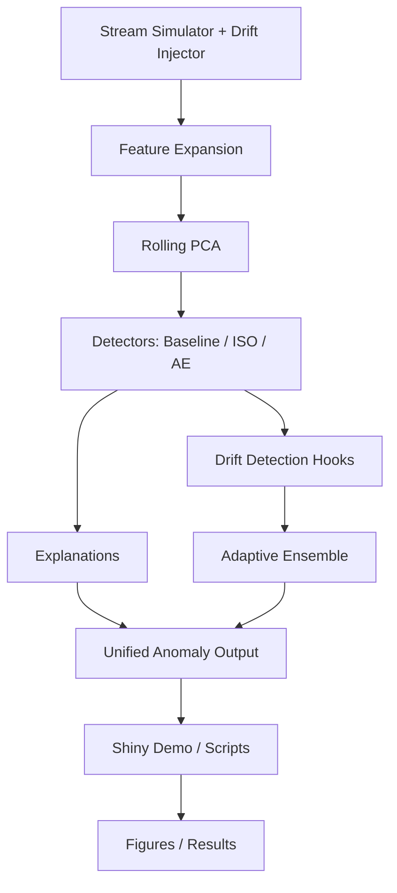

# Scalable, Adaptive Anomaly Detection for Housing Streams

This repo is a portfolio-ready, production-flavored R project for streaming, drift-aware anomaly detection on housing/real-estate signals.

## Quickstart (Milestone 1)

1) Ensure R (>=4.5) is installed and on PATH.
2) Project-scoped deps via renv:
   ```powershell
   & "C:\Program Files\R\R-4.5.2\bin\R.exe" --vanilla -q -e "renv::restore()"
   ```
3) Run the stream with drift + feature expansion + rolling PCA + multi-detector scoring:
   ```R
   source("scripts/run_stream.R")
   run_stream("configs/demo.yaml")
   ```

Outputs: `results/baseline_anomalies.csv` (or config `logging$output_name`) with:
- per-detector scores/flags (baseline, isolation forest, optional torch AE)
- drift flags/metrics
- ensemble score/flag + weights per window
- mapped top features + explanation text

## Structure
- `configs/` configuration files (start with `demo.yaml`)
- `R/streaming/` simulators + windowing
- `R/detectors/` detector interfaces and implementations
- `R/utils/` lightweight logging
- `scripts/` entrypoints (e.g., `run_stream.R`)
- `tests/` (to be added)
- `apps/` Shiny demo (later milestone)

## State/Interface Conventions
- Stream schema: `timestamp`, `id`, `market`, numeric signals (`price`, `rent`, `days_on_market`, `inventory`, `rate_proxy`, `unemp_proxy`), `is_anomaly_true`.
- Detector interface: `fit_initial`, `partial_fit`, `score`, `detect`; state object created via `new_detector_state`.
- Feature expansion: `expand_features()` supports interaction terms, rolling stats, and noise features to reach target dimensionality.
- Rolling PCA: `fit_pca_state()`, `maybe_refit_pca()` manage refit schedule; `transform_pca()` applied per window.
- Drift detection: `detect_drift()` computes KS/mean/variance shifts; drift flags are logged per window.

## Experiments
- Sweep drift type, anomaly rate, dimensionality:
  ```R
  source("scripts/run_experiment.R")
  run_experiment()
  ```
- Summary saved to `results/experiment_summary.csv`; per-run outputs saved to `results/exp_*.csv`.

## Torch note
- Autoencoder detector depends on `torch`. Install once:
  ```R
  install.packages("torch")
  torch::install_torch()
  ```
- Then set `detectors$autoencoder_torch$enabled: true` in `configs/demo.yaml`.
- CI skips autoencoder (torch optional); baseline + ISO always run.

## Ensemble (Milestone 4)
- Config block `ensemble` controls alpha and threshold.
- Adaptive weights update via EMA on window-level F1 when truth available; fallback to stability heuristic otherwise.
- Weight trajectories are logged per window in result CSV columns `weight_*`.

## Shiny Demo (Milestone 5)
- Launch:
  ```R
  shiny::runApp("apps")
  ```
- Tabs:
  - Live Stream: adjust drift/anomaly/dim/window; toggle detectors/ensemble; step or auto-play; see market + anomaly markers, drift metric, ensemble weights, thresholds.
  - Explanations: pick a window to view top_features, explanation_text, per-detector scores.
  - Experiment Viewer: run preset sweeps and view summary table/plot.
- If torch is not installed, AE controls are hidden/disabled; app still works with baseline + ISO.
- Outputs saved to `results/shiny_stream.csv` when running the live stream.

## Architecture (Mermaid)


## Why this matters for housing markets
- Markets drift with rates, inventory, and seasonality; detectors must adapt.
- Local shocks (micro-markets) need contextual detection, not static thresholds.
- Explainability builds trust with operators and stakeholders.

## What I'd build next
- Kafka-backed streaming + plumber API for scoring.
- Spatial neighborhood graph features (sf) for collective anomalies.
- Deeper online learning for thresholds and AE fine-tuning.

## Resume-ready bullets
- Built a drift-aware, streaming anomaly platform in R with adaptive ensemble (baseline/Isolation Forest/torch AE), rolling PCA, and explainability mapped back to housing features.
- Implemented Shiny live demo with drift/anomaly controls, weight trajectories, and explanation panels; experiment runner for sweeps.
- Added evaluation scripts, reproducible renv setup, and testthat coverage across streaming, features, detectors, ensemble, and explanations.

## Next Milestones
- Add Isolation Forest + torch autoencoder detectors
- Adaptive ensemble + explainability
- Shiny live demo